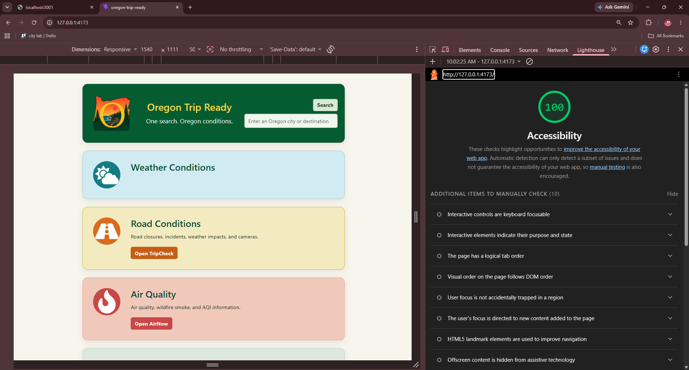

# Oregon Trip Ready

  

> Check current weather and quickly access official Oregon travel resources before you leave.

---

## About

Oregon Trip Ready is a responsive web application for Oregon residents and visitors. Users can search an Oregon destination for current weather and quickly access official road, air-quality, weather-alert, coast, avalanche, camera, and earthquake resources. The application was built with accessibility, responsive design, and clear visual navigation in mind.

---

## Problem Domain

Planning travel in Oregon often requires checking several separate weather, road, air-quality, and hazard websites. Oregon Trip Ready provides one starting point for current weather and direct links to trusted official resources.

---

## User Story

**As an Oregon resident or visitor, I want to search a destination and quickly view current weather and official condition resources so I can make informed decisions before leaving.**

---

## Features

- Oregon destination weather search
- Current temperature, feels-like temperature, humidity, weather condition, description, and wind speed
- Responsive mobile-first layout
- Accessible form controls and keyboard navigation
- TripCheck road conditions
- AirNow air quality and wildfire smoke
- National Weather Service alerts
- Road cameras
- Coast conditions
- Avalanche information
- USGS earthquake information
- Accessible About modal

---

## Accessibility

Accessibility was a primary design goal for Oregon Trip Ready.

- Lighthouse Accessibility Score: **100**
- Semantic HTML
- Accessible form labels
- Keyboard-accessible controls
- Visible focus indicators
- Responsive text and layouts
- Accessible names for icon links
- Reduced-motion support

---

## Built With

- React
- Vite
- JavaScript
- CSS
- React Bootstrap
- React Icons
- Axios
- Node.js
- Express
- OpenWeather API

---

## Official Data Sources

- OpenWeather
- AirNow
- Oregon TripCheck
- National Weather Service
- Oregon road-camera resources
- Oregon coast-condition resources
- Avalanche information
- USGS Earthquakes

Only current weather is retrieved through the Oregon Trip Ready backend. The other resources currently open official external websites.

---

## Stretch Goals

### Completed

- Responsive mobile layout
- Accessible More Resources icon navigation
- About modal
- Lighthouse Accessibility score of 100
- Clear loading, validation, and error states
- Improved visual design and responsive header

### Future Improvements

- Dark mode
- Live TripCheck API integration
- Live AirNow API integration
- Route and road-condition APIs when stable public access is available
- Embedded road cameras
- Current-location support
- Saved or favorite destinations, Auth0
- Additional Oregon and Pacific Northwest travel resources

---

## License

This project is licensed under the MIT License.

See the [LICENSE](LICENSE) file for details.
