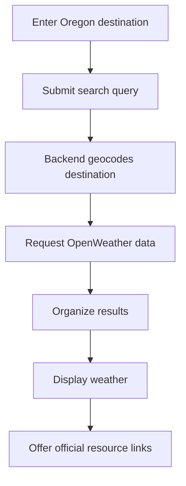
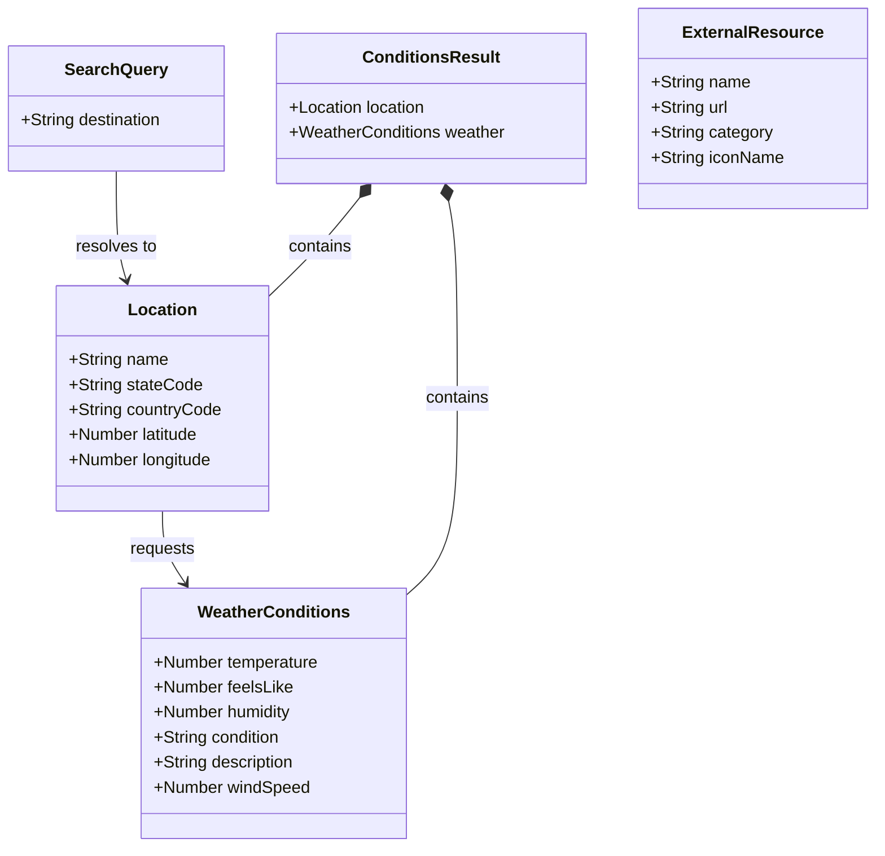
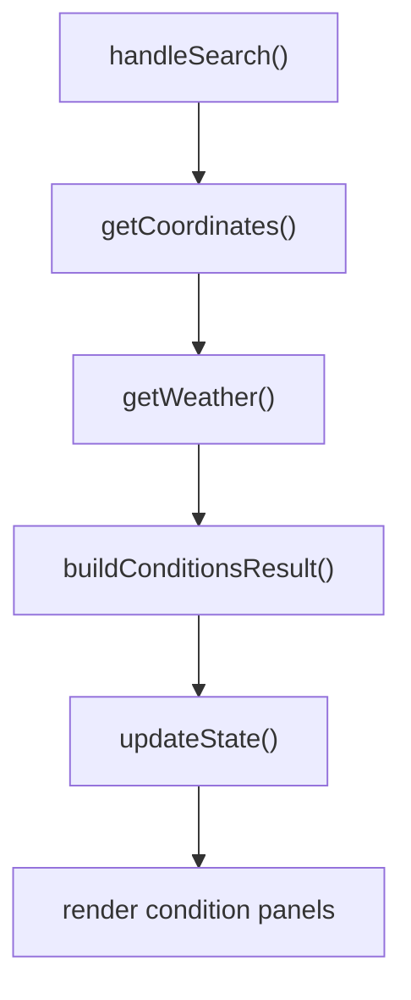

# Oregon Trip Ready

  

> A responsive travel-planning application that helps Oregon residents and visitors quickly check weather conditions and access official road, air quality, and hazard resources before traveling.

## Features

- Oregon destination weather search
- Responsive mobile-first design
- Accessible interface
- Road Conditions (TripCheck)
- Air Quality & Wildfire (AirNow)
- More Resources icon panel
- About modal

## Built With

- React
- Vite
- JavaScript
- CSS
- React Bootstrap
- React Icons
- Axios
- Express
- Node.js
- OpenWeather API

## Accessibility

### Production Lighthouse Results

- Accessibility: 100

The accessibility audit was run against the Vite production preview build using Chrome Lighthouse.

## Table of Contents

- [Features](#features)
- [Built With](#built-with)
- [Accessibility](#accessibility)
- [Vision](#vision)
- [Project Scope](#project-scope)
- [Minimum Viable Product](#minimum-viable-product)
- [User Stories](#user-stories)
- [Functional Requirements](#functional-requirements)
- [Application Data Flow](#application-data-flow)
- [External Data Sources](#external-data-sources)
- [Stretch Goals](#stretch-goals)
- [Non-Functional Requirements](#non-functional-requirements)
- [Security](#security)
- [Limitations and Disclaimer](#limitations-and-disclaimer)
- [Domain Model](#domain-model)
- [Function Relationships](#function-relationships)
- [Future Improvements](#future-improvements)
- [License](#license)

---

## Vision

Oregon Trip Ready is a one-stop starting point for checking conditions before traveling to an Oregon destination. A user can search for a location, view current weather and access official air-quality information.

The application addresses the inconvenience of searching several unrelated websites before a trip. It also provides quick links to official resources for wildfire smoke, air quality, road conditions, cameras, weather alerts, avalanche forecasts, and earthquakes.

## Project Scope

### Included

Oregon Trip Ready:

- Allow users to search for an Oregon destination.
- Display current weather from the OpenWeather API.
- Provide a link to current air-quality and wildfire-smoke information on AirNow.
- Present weather in a readable panel.
- Provide clear loading, no-data, and error messages.
- Use a responsive, mobile-first React interface.
- Follow basic web accessibility practices.

### Not Included

The completed application does not:

- Decide whether a user should travel.
- Replace official emergency warnings or instructions.
- Require authentication or user accounts.
- Save trips or personal information.
- Use MongoDB or CRUD functionality.
- Include an AI assistant or chatbot.

## Minimum Viable Product

The MVP allows a user to enter an Oregon destination in a search bar. The frontend sends the destination to the backend as a search query. The backend locates the destination and retrieves current weather information. The frontend then displays the weather results and provides a clearly labeled button to the official AirNow Fire and Smoke Map.

### MVP Features

- [x] Oregon destination search
- [x] Current weather results
- [x] Loading indicator
- [x] Invalid-location message
- [x] API and unavailable-data messages
- [x] Responsive results display
- [x] Accessible form controls and results
- [x] AirNow external-resource button

## User Stories

### 1. Search for an Oregon Destination

> As a traveler, I want to search for an Oregon destination so that I can quickly check conditions before leaving.

### 2. View Current Weather

> As a traveler, I want to see current weather at my destination so that I can prepare for expected conditions.

### 3. Access Current Air-Quality Information

> As a traveler, I want a link to official air-quality information so that I can decide what health precautions to take.

### 4. Handle an Invalid Destination

> As a traveler, I want a clear message when a destination cannot be found so that I can correct my search.

### 5. Use the Application Accessibly

> As a traveler using a keyboard or assistive technology, I want clearly labeled and accessible controls so that I can use the application independently.

## Functional Requirements

### Destination Search

The application must:

- Accept an Oregon destination through a search form.
- Prevent an empty search from being submitted.
- Send the destination to the backend as a search query.
- Convert the destination into geographic coordinates.
- Display a useful error if the destination cannot be found.

### Weather Conditions

The application must:

- Request current weather for the destination.
- Display the destination name, temperature, and weather description.
- Display other available conditions, such as wind or precipitation.
- Display an error if weather data cannot be retrieved.

### Air-Quality Resource

The application must:

- Provide a link to the AirNow Fire and Smoke Map.
- Use descriptive link text that identifies the resource.

## Application Data Flow

1. The user enters an Oregon destination.
2. The frontend sends the destination to the backend as a search query.
3. The backend converts the destination into latitude and longitude.
4. The backend requests weather data from OpenWeather.
5. The backend organizes the returned information.
6. The backend sends the results to the frontend.
7. The frontend displays the weather panel.
8. The user may open an official external resource for additional information.

### Workflow Diagram

## External Data Sources

| Source | Information | Project Use |
|---|---|---|
| OpenWeather API | Current weather | MVP API |
| [AirNow Fire and Smoke Map](https://fire.airnow.gov/) | Air quality, wildfire smoke and fire information | MVP external resource |
| [TripCheck](https://tripcheck.com/) | Road conditions, incidents and cameras | External stretch link |
| [NWS Hazards Viewer](https://www.weather.gov/wrh/hazards) | Weather warnings and hazard maps | External stretch link |
| [Oregon Avalanche Forecasts](https://www.weather.gov/pdt/AvalancheWeather) | Regional avalanche information | External stretch link |
| [USGS Latest Earthquakes](https://earthquake.usgs.gov/earthquakes/map/) | Recent seismic activity | External stretch link |

## Stretch Goals

The AirNow Fire and Smoke Map button is part of the MVP. The completed application also provides accessible icon links to TripCheck, NWS weather hazards, Oregon avalanche forecasts and USGS earthquake information. These additional links:

- Use visible, descriptive text instead of relying on an icon alone.
- Be accessible by keyboard.
- Open the official resource in a new browser tab.
- Leave the Oregon Trip Ready application open.

The external websites' data is not processed by Oregon Trip Ready.

## Non-Functional Requirements

### Accessibility

The application uses semantic HTML, associated form labels, keyboard-accessible controls, and descriptive link text. Decorative React icons are hidden from screen readers, while meaningful icon links have accessible names.

The completed application was evaluated with Chrome Lighthouse against the Vite production preview build. The production accessibility result and screenshot are included above.

### Usability

The application uses a mobile-first layout with a prominent search bar and concise condition panels. Loading, error, and unavailable-data messages explain the application's current state. External links use recognizable icons with visible labels.

## Security

API keys are stored in backend environment variables and are not committed to GitHub. The frontend requests information through the backend instead of exposing private API keys in browser code.

The `.env` file remains listed in `.gitignore`. An `.env.example` file can document the required variable names without including secret values.

## Limitations and Disclaimer

Oregon Trip Ready provides information for planning convenience only. Conditions can change rapidly, and information from third-party services may be delayed or unavailable. Users should verify important information through official agencies and follow all emergency instructions.

## Domain Model

Oregon Trip Ready does not store user data. Its domain model represents the temporary data created when a user searches for an Oregon destination.

A search query is converted into a location. That location is used to request current weather information. The result is displayed to the user.

### Domain Entities

#### Search Query

Represents the destination entered by the user.

| Property | Data Type | Description |
|---|---|---|
| `destination` | String | Oregon destination entered by the user |

#### Location

Represents the geographic location returned by the geocoding service.

| Property | Data Type | Description |
|---|---|---|
| `name` | String | Destination name |
| `stateCode` | String | State abbreviation, such as `OR` |
| `countryCode` | String | Country abbreviation, such as `US` |
| `latitude` | Number | Geographic latitude |
| `longitude` | Number | Geographic longitude |

#### Weather Conditions

Represents current weather returned by OpenWeather.

| Property | Data Type | Description |
|---|---|---|
| `temperature` | Number | Current temperature |
| `feelsLike` | Number | Current feels-like temperature |
| `humidity` | Number | Current humidity percentage |
| `condition` | String | Main weather condition |
| `description` | String | Short description of current conditions |
| `windSpeed` | Number | Current wind speed |

#### Conditions Result

Represents the combined response returned to the frontend.

| Property | Data Type | Description |
|---|---|---|
| `location` | Location | Geocoded destination information |
| `weather` | WeatherConditions | Current weather result |

#### External Resource

Represents an official external resource displayed as an MVP or stretch-goal link.

| Property | Data Type | Description |
|---|---|---|
| `name` | String | Name of the external resource |
| `url` | String | Official website address |
| `category` | String | Resource type, such as fire, road or seismic |
| `iconName` | String | React Icons identifier |

### Domain Relationships

- One `SearchQuery` resolves to one `Location`.
- One `Location` is used to request one current `WeatherConditions` result.
- One `ConditionsResult` contains one `Location` and one `WeatherConditions` result.
- The application may display multiple `ExternalResource` links.
- None of these entities are saved after the search session.

### UML Domain Model

### Function Relationships

| Function | Input | Output | Responsibility |
|---|---|---|---|
| `handleSearch()` | Search form event | None | Captures and submits the search query |
| `getCoordinates()` | Destination string | Location object | Converts the destination into coordinates |
| `getWeather()` | Latitude and longitude | WeatherConditions object | Retrieves current weather |
| `buildConditionsResult()` | Location and weather | ConditionsResult object | Organizes the API results |
| `updateState()` | ConditionsResult object | Updated React state | Causes the result panels to render |

## Future Improvements

Some older AirNow current-observation API services are scheduled for retirement in fall 2026. For the MVP, Oregon Trip Ready links users directly to AirNow for current air-quality and wildfire-smoke information. A future version may restore in-app AQI results after a stable replacement service and appropriate caching are implemented.

## License

This project is licensed under the MIT License.

See the [LICENSE](LICENSE) file for details.
